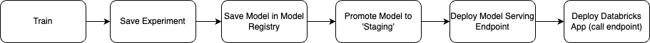

# my_model_deployment_project

## Table of Contents
1. [Introduction](#introduction)
2. [Components Overview](#components-overview)
3. [Databricks DAB - Bundle Deploy](#databricks-dab---bundle-deploy)
    - [Databricks Training Notebook](#databricks-training-notebook)
    - [Databricks Deploy/Update Model Notebook](#databricks-deployupdate-model-notebook)
4. [GitHub Actions - CI/CD](#github-actions---cicd)

## Introduction

The ML Pipeline provides a high-level view of the typical steps involved in developing and deploying a machine learning model using Databricks. This include following potential steps:

* Automating workflow with GitHub Actions,
* Deploying the model through Databricks Model Serving Endpoints, where it can be exposed to any consumer layer like for instance dashboards.

---

## Components Overview

1. **Databricks DAB - Bundle Deployment of Databricks Workflows**
    - Databricks Training Notebook
    - Databricks Deploy/Update Model Notebook

2. **GitHub Actions - CI/CD**
    - Deploy Bundle (DAB) to Databricks

---

## Databricks DAB - Bundle Deploy

### Databricks Training Notebook

1. **Train**
    - This step involves training the machine learning model (Logistic Regression) using the Databricks environment.
    - Leverage Databricks workflows to manage and orchestrate the training process efficiently.

2. **Save Experiment**
    - Save the results of the training experiment.
    - Ensure reproducibility by logging experiment parameters, metrics, and artifacts (`mlflow.sklearn.autolog()` is being used here).

3. **Save Model in Model Registry**
    - Register the trained model in the Databricks Workspace Model Registry.
    - Facilitate model versioning, tracking, and governance.

4. **Promote Model to 'Staging'**
    - Transition the model from the experimental phase to the 'Staging' phase (this could be Production as well).
    - At this stage, we could ensure the model is ready for further testing and validation before production deployment (this could be automated tests or manual testing - this is not covered in this example).

### Databricks Deploy/Update Model Notebook

1. **Deploy Model Serving Endpoint**
    - Deploy the model to a real-time serving endpoint in Databricks (we advice to not use streaming endpoint unless you know for sure you need it).

2. **Set Model Endpoint Permissions**
    - Configure access permissions for the model endpoint.
    - Ensure secure and controlled access to the deployed model.

---

## GitHub Actions - CI/CD

1. **Deploy DAB**
    - Automate the Databricks Workflow deployment (DAB) process using GitHub Actions.
    - Ensures consistent and repeatable deployment.

---