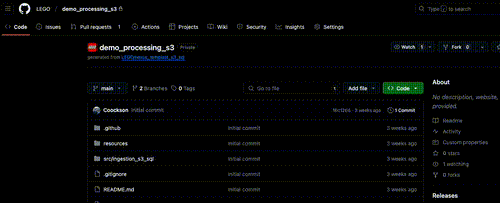
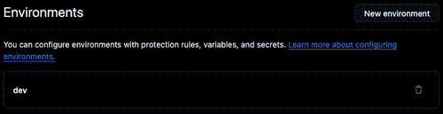
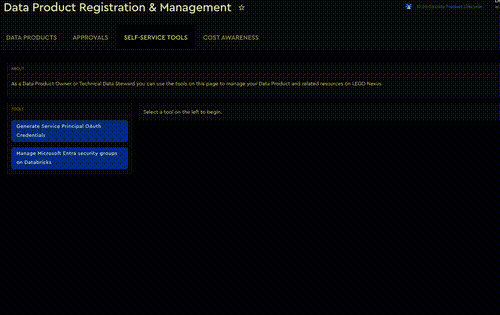
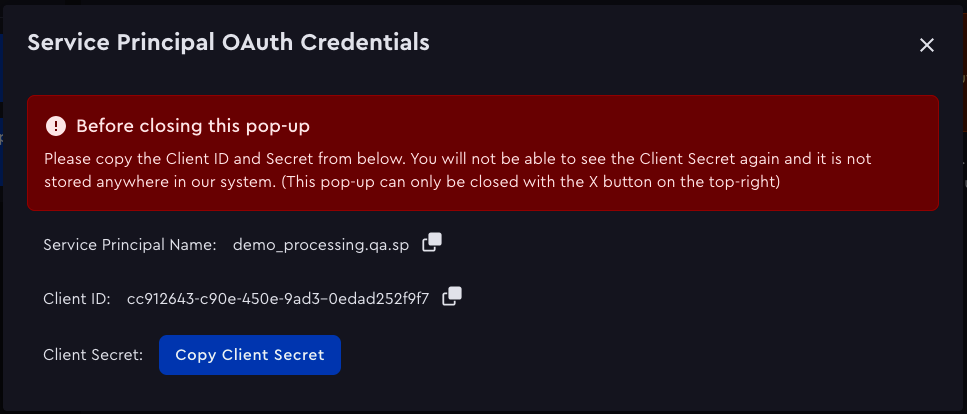
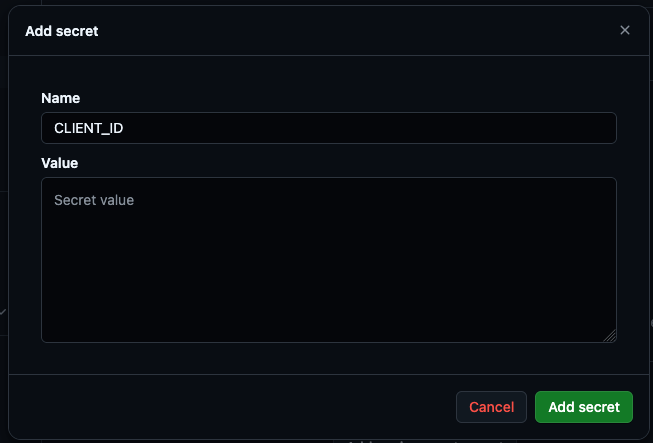
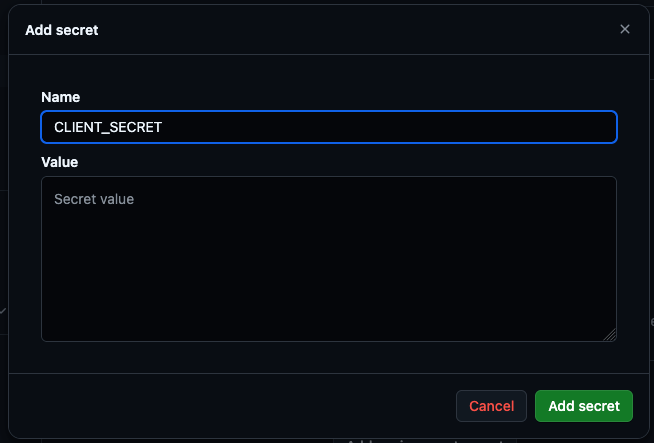

This repository was created based on a GitHub template from [nexus-dab-templates](https://github.com/LEGO/aia-workflow-generator).
<!-- TO NOT REMOVE ml_pipeline -->

# my_model_deployment_project
## Quickstart Guides

<details>
  <summary>Expand for quickstart guide for first time setup</summary>

### First time setup

To use the GitHub actions and deploy your code to Databricks using your service principal, you need to first add the necessary `CLIENT_ID` and `CLIENT_SECRET` to authenticate with Databricks. Without this in place your deployments will fail.

1. Create your environments
    - In your repository, go to `Settings > Environments > New environment` and create your environments called `dev`, `qa` and `prod` 
<p align="center">
  
</p>

2. Add your data product's service principals' credentials as environment secrets
    - Click on one of the environments you have created in step 1

    <p align="center">
      
    </p>

    - Open [Nexus Self-Service Tools](https://baseplate.legogroup.io/catalog/default/Tool/onex/self_service_tools/generate_sp_credentials) and click on `Generate Service Principle OAuth Credentials`
        - Select your data product from the dropdown
        - Select your Service Principle that corresponds to your environment

        <p align="center">
          
        </p>

        - This will provide you with the following values with will be used in the *next step*:
            - **client id**
            - **client secret**
        <p align="center">
          
        </p>

    - Back in your repository, click on `add environment secret` in the environment that was selected in the previous step
        - create a environment secret called `client_id` and paste the value of the `client id` field from the self service tool in the step before 

        <p align="center">
          
        </p>

        - create a environment secret called `client_secret` and paste the value of the `client secret` field from the self service tool in the step before 

        <p align="center">
          
        </p>

        - 🔁 repeat this for all environments

🎉 **Congratulations! The repository is ready!** 🎉

> 💡 **Tip**
>
> Find implementation examples for common use cases [here](https://github.com/LEGO/nexus-workflow-generator-example).

<br/>

</details>

<details>
  <summary>Expand for quickstart guide for how to develop in the browser</summary>

### Development in the browser

Development can be done in the browser using Github Databricks Git folders

- [Run Git operations on Databricks Git folders (Repos)](https://docs.databricks.com/aws/en/repos/git-operations-with-repos)

See the next quickstart guide for how to deploy for a step by step guide to get your code in Databricks.

---

</details>

<details>
  <summary>Expand for quickstart guide for how to deploy</summary>

### How to deploy

   | NAME | DESCRIPTION |
   | --- |--- |
   | **Deployment DEV** | Triggered when making a commit to `dev/` branches. Can be also triggered manually in the GitHub web UI.|
   | **Deployment QA** | Triggered when creating a Pull Request (PR) to the `main` branch.|
   | **Deployment PROD**| Triggered automatically on [new releases created in GitHub](https://docs.github.com/en/repositories/releasing-projects-on-github/managing-releases-in-a-repository?tool=webui).|

### Step by step example on how to deploy to dev, qa and prod

1. Create a branch with the `dev/` prefix, such as `dev/my-first-data-product`

    > 💡 **Tip**
    >
    > If you are unsure how to create a branch check out the [step by step guide](https://docs.databricks.com/aws/en/repos/git-operations-with-repos#create-a-new-branch)


2. Prepare your code, adjust all the fields with a comment called `TODO` or nested between `<>`

    > 💡 **Tip**
    >
    > If you search for the term `TODO` in the repository you will find all the fields you need to change!

3. Push your code to github and create a pull request so your colleagues can review your work. This will also trigger a deployment to `dev`

    > 💡 **Tip**
    >
    > If you are unsure how to push your changes check out the [step by step guide](https://docs.databricks.com/aws/en/repos/git-operations-with-repos#commit-and-push-changes-to-the-remote-git-repository)
    >
    > If you are unsure how to create a pull request check out the [step by step guide](https://docs.github.com/en/pull-requests/collaborating-with-pull-requests/proposing-changes-to-your-work-with-pull-requests/creating-a-pull-request#creating-the-pull-request)

4. After you get approval, merge the pull request to the main branch. This will trigger a deployment to `qa`

5. Create a release. This will trigger a deployment to `prod`

    > 💡 **Tip**
    >
    > If you are unsure how to create a release, the github tutorial shows a [step by step guide](https://docs.github.com/en/repositories/releasing-projects-on-github/managing-releases-in-a-repository#creating-a-release).

---

</details>


## Configure Your Workflows

<details>
  <summary>Expand for quickstart guide on workflow configuration</summary>

   <br/>

   The main file is `databricks.yml` at the root of your code base. It acts as the "entry door" to your Databricks configuration. It can reference multiple `resources`, explained below.
   
   The "blueprint" or configuration of your job is located under the `resources` directory and ends with `.yml`. The rule of thumb is, one configuration equals one workflow. However, you can create as many configurations as you need. Simply create a new YML file.

   The purpose of the configuration files is that you can specify in code how your Databricks workflows should look like, and not have to do it manually inside of Databricks. This removes the need to remember what has been configured, avoids misconfiguration between environments, and helps with better collaboration in the team.

> 💡 **Tip**
>
> Name your configuration files as something meaningful. Often a good approach is to make it match the name of the actual job in Databricks.

The most common items to configure in the yml file are:

- `job_name`
- `email_notifications`
- `schedule`
- `tasks`
- `parameters`

By default, the configuration includes **tasks**. Each `task` is associated with a specific file. You can name the `task_key` whatever you like, as with any other files you plan to use.

<br/>

</details>

## Securely Manage Your Secrets

<details>
  <summary>Expand for details on secret management</summary>

Avoid exposing your Personal Access Tokens (PAT), API keys, tokens, passwords, and similar in your repositories.

> ⚠️ Warning
>
> **Do not hardcode secrets directly in your code and notebooks in plain text.**

Instead, securely store and access them using [Databricks Secret Management](https://docs.databricks.com/en/security/secrets/index.html).

As a technical data steward, you will have your secret scope available for DEV, QA, and PROD after you have registered your Data Product. You can look into the naming convention of it at [Secret scope and PAT secrets](https://baseplate.legogroup.io/docs/default/component/lego-nexus/concepts/data-product-resources/#secret-scope-and-pat-secrets).  

To create and manage secrets, you will need to use the [databricks CLI](https://docs.databricks.com/en/dev-tools/cli/index.html) or the [Databricks API](https://docs.databricks.com/api/workspace/introduction).

Once your secret is stored, you can access it in your code with the following snippet:

```python
SECRET = dbutils.secrets.get(
    scope=f"name_of_your_scope.{ENV_OF_YOUR_CHOICE}.sp.secret_scope", 
    key="<name_of_your_secret>"
)
```
</details>


## FAQ

<details>
  <summary>Expand to view the FAQ's</summary>

### Q: Why do we use multiple environments?

**A:** It is crucial to test both your **code** and the **data before** delivering them in a production environment. Once you are in production, it means the **code** and **data** have been:

 1. tested
 2. reviewed
 3. approved

> 💡 **Tip**
>
> Consider it this way, **you aim to produce data that is reliable for your consumers**

### Q: I do not see my branch automatically deployed on the dev environment?

**A**: Double check if u have named your branch correctly. By default it needs to have a `dev` prefix to automatically deploy. If you want to change this behavior, adjust the trigger in the `bundle-cd-dev.yml` script.

### Q: I get an error when I try to deploy locally?

**A:** Make sure you authenticate first, before doing a local deployment.

### Q: I get a network error when I try to deploy locally?

**A:** When experiencing this on a Mac, there are a few things to try. Open a new instance of your terminal in VSCode. What has also worked is to use your Mac terminal, rather than the integrated one in VSCode.

### Q: The `init` command "hangs" when I run it in the terminal?
**A:** Double check if you are properly authenticated against GitHub. Check your [SSH key set up](https://docs.github.com/en/authentication/connecting-to-github-with-ssh). Easiest thing to try is to `clone` the repo and see if you manage. If you still have problems, we suggest you create your repo using one of the provided templates. More info at [Baseplate Documentation DABS](https://baseplate.legogroup.io/docs/default/Component/lego-nexus/concepts/tools/dab/)

</details>

